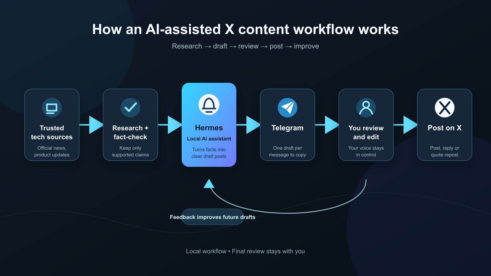

# Trend Scout

Trend Scout is a free-first, human-in-the-loop X content workflow for tech creators.

It discovers recent, verifiable tech stories, saves a small trend inbox, and helps turn those stories into drafts you can review and manually post. It does **not** post to X automatically.



## What is live now

- Free public-source discovery runs hourly in GitHub Actions, even while the laptop is off.
- The cloud job saves a compact, deduplicated trend inbox to `data/trend-inbox.json`.
- A local Hermes + Telegram setup can turn the saved stories into drafts and send **one draft per Telegram message** for easy copying.
- You review, edit, and manually post, reply, or quote repost on X.
- Feedback such as “this sounds like me” is stored locally and reused as a voice preference for later drafts. This is retrieval-based learning, not automatic model fine-tuning.
- Ollama is optional and used only for local drafting. The free cloud scan does not need Ollama, an X API key, or a paid LLM key.

## How it works

1. Recent stories are collected from public tech sources.
2. Stories without sufficient source support are excluded from post-ready drafting.
3. Distinct verified stories are saved in the trend inbox for a limited time.
4. Hermes can read the inbox, use your saved voice feedback, and prepare drafts.
5. Telegram receives drafts separately so each can be copied directly into X.
6. Your edits and feedback improve the next batch; you always make the final publishing decision.

## What runs in the cloud vs locally

| Part | Where it runs | Needs your laptop awake? | Cost in the default setup |
| --- | --- | --- | --- |
| Hourly source discovery and inbox update | GitHub Actions | No | Free for public repositories using standard Linux runners |
| Hermes chat, Telegram replies, and local drafting | Your Mac | Yes | Free with your existing local setup |
| Ollama draft generation | Your Mac | Yes | Free after the model download |
| Final post, reply, or quote repost | You in X | No automation | Free |

> GitHub Actions is used only to collect and store sources. It never posts to X, sends Telegram messages, or calls a paid model in the default workflow.

## Quick start

```bash
git clone https://github.com/Akshitwadhwa/Trend-Scout.git
cd Trend-Scout
make install
```

Run the local web app:

```bash
make dev
```

Then open `http://127.0.0.1:8000`.

Run a fresh general tech scan:

```bash
make fresh
```

The newest copy-ready drafts are saved in `out/`.

## Useful commands

```bash
make fresh        # general verified tech pack
make top-ai       # curated AI-account source signals
make india        # India-aware tech angles
make growth       # growth-oriented formats
make nvidia       # chips, GPUs, AI infrastructure
make tesla        # EVs, FSD, Optimus, energy
make wearables    # Garmin, WHOOP, Oura, Apple Watch, Samsung Health
make reply-scout  # source links plus reply ideas
make test         # run the test suite
```

For the focused wearable inbox used by Hermes, run this only when you ask for wearable content:

```bash
. .venv/bin/activate
python scripts/scan_wearables_inbox.py
```

It caches recent results locally, so repeated requests are fast and do not re-scan unnecessarily.

## Free hourly trend inbox

The workflow in `.github/workflows/cloud-trend-inbox.yml` runs once per hour and commits the latest free-source inbox back into the repository.

To enable it in GitHub:

1. Open the repository on GitHub.
2. Go to **Settings → Actions → General**.
3. Under **Workflow permissions**, choose **Read and write permissions**.
4. Open the **Actions** tab and enable workflows if GitHub asks.

The inbox is saved at:

```text
data/trend-inbox.json
data/trend-inbox.md
```

The inbox contains source facts and links, not automatically published posts. It is intentionally limited to avoid old news and duplicate ideas.

## Hermes + Telegram workflow

After connecting Telegram to Hermes, the everyday flow is simple:

```text
You: “Send me 10 fresh tech drafts separately”
Telegram: receives 10 individual draft messages
You: copy one, edit it if needed, and post it to X
```

For a focused request:

```text
You: “Give me 6 latest Garmin vs WHOOP drafts separately”
Hermes: refreshes the local wearable cache only for that request
Telegram: receives source-grounded drafts one by one
```

Hermes and Telegram are local in this setup. They work while the Mac is awake and connected to the internet. The hourly GitHub source scan continues while the Mac is off, but it cannot generate or deliver Telegram drafts until Hermes is available again.

See [HERMES_INTEGRATION.md](HERMES_INTEGRATION.md) for the local Hermes setup notes.

## Make drafts sound more like you

Start with examples instead of trying to fine-tune a model:

1. Add 8–15 posts that genuinely sound like you to `data/voice-profile.md`.
2. When a draft is good, tell Hermes why: for example, “factually correct, casual, and useful—save this style.”
3. When it misses, say what to change: “less formal,” “explain the news first,” or “add a stronger personal take.”
4. Keep your edited final posts as future voice examples.

The system retrieves those preferences before drafting. Once you have a large set of consistently edited posts, you can evaluate a real fine-tuning experiment separately; it is not required for the workflow to improve.

## Source and safety rules

- Treat official company announcements and reputable reporting as sources, not random social posts.
- Do not claim an unverified rumor as fact.
- Do not force a comparison such as Garmin versus WHOOP unless both sides have current source support.
- Open the source link before posting any high-stakes claim.
- Do not commit API keys, Telegram tokens, X credentials, or private feedback data.
- Keep manual review before every X post.

## Optional local Ollama

Ollama improves local draft generation, but it is not needed for the free hourly inbox.

```env
ENABLE_OLLAMA=true
OLLAMA_BASE_URL=http://127.0.0.1:11434
OLLAMA_MODEL=qwen2.5:3b
```

Use a smaller model if the Mac becomes slow. Ollama must be running only when you are generating local drafts; it does not need to stay running for GitHub Actions to collect trends.

## Configuration

Copy the example environment file and fill only the features you use:

```bash
cp .env.example .env
```

For the strict free workflow, leave paid provider keys empty and use the public-source scanner:

```env
ENABLE_X_SCAN=false
ENABLE_X_WATCHLIST=false
ENABLE_X_TIMELINE=false
ENABLE_WEB_SCAN=true
ENABLE_OPENAI_RESEARCH=false
ENABLE_OPENAI_DRAFTS=false
```

X timeline scanning and OpenAI web research are optional extras. They are disabled by default and are not needed for the GitHub hourly inbox.

## Output files

| Location | What it contains |
| --- | --- |
| `data/trend-inbox.json` | Latest cloud-saved, source-grounded stories |
| `data/voice-profile.md` | Writing examples you choose to save |
| `out/*-verified-tech-brief.md` | Source and verification notes |
| `out/*-copy-paste-tweets.md` | Drafts ready for your review and manual copy-paste |
| `outputs/` | Regular Markdown drafts |
| `json/` | Structured run artifacts |

## Development

```bash
make test
make compile
```

Contributions are welcome. Please read [CONTRIBUTING.md](CONTRIBUTING.md) and follow [SECURITY.md](SECURITY.md) before opening a pull request.
